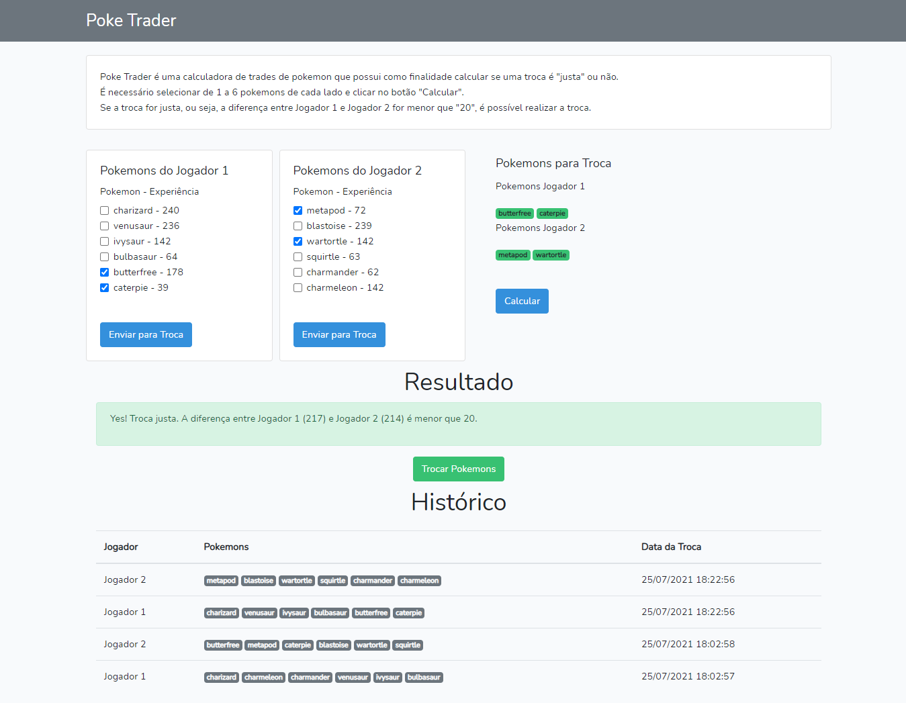

# Poke Trader

[](public/img/poke-trader.png)    

### Acesse em:
```
https://poke-trader-php.herokuapp.com/
```

### O projeto
```    
Poke Trader é uma calculadora de trades de pokemon que possui como finalidade calcular se uma troca é "justa" ou não.
É necessário selecionar de 1 a 6 pokemons de cada lado e clicar no botão "Calcular".
Se a troca for justa, ou seja, a diferença entre Jogador 1 e Jogador 2 for menor que "20", é possível realizar a troca.

O projeto é implementado em Laravel e faz utilização do Livewire e Boostrap.
```

### Instale as dependências do projeto:
```
composer install
```

### Copie o arquivo ".env.example", cole no projeto e renomeie para  ".env"

### Gere a APP_KEY:
```
php artisan key:generate
```

### No arquivo ".env", altere as configurações de conexão com o banco de dados, por exemplo:
```
DB_CONNECTION=mysql
DB_HOST=127.0.0.1
DB_PORT=3306
DB_DATABASE=poke-trader
DB_USERNAME=root
DB_PASSWORD=
```

### Faça a migração das tabelas para o banco de dados:
```
php artisan migrate
```

### Faça a carga inicial de dados:
```
php artisan db:seed
```

### Rode o projeto:
```
php artisan serve
```

### Acesse em:
```
http://localhost:8000/
```
